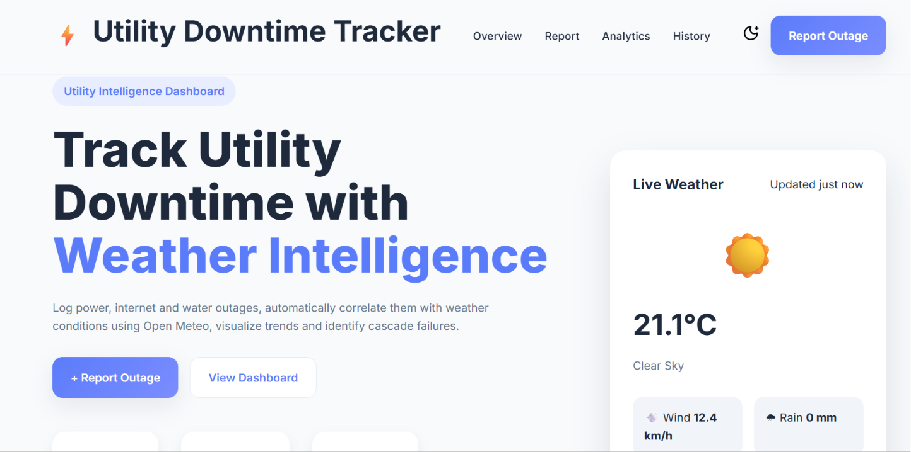

# ⚡ Local Utility Downtime Tracker

> A responsive web application that helps users to record, manage and analyze utility outages while automatically capturing the current weather conditions.

<p align="center">
  
</p>

<p align="center">
  <a href="YOUR_LIVE_DEMO_LINK"><strong>🚀 Live Demo</strong></a>
</p>


# Problem

Power cuts, internet outages and water supply interruptions are something many of us experience regularly. Most of the time, we simply remember them or discuss them in messaging groups, but those records are quickly lost.

Without a proper history, it's difficult to answer questions like:

- Are outages becoming more frequent?
- Which utility is the least reliable?
- How long do outages usually last?
- Is there any relationship between weather conditions and outages?

So, I wanted to build a simple application that makes it easy to record outage information and visualize those patterns over time.


# Why I Built This?

After completing my Python OOP project, **SmartExpiry**, I wanted my next project to focus entirely on frontend development.

Instead of creating another to do list or weather application, I wanted to challenge myself by combining multiple frontend concepts into a single project.

This project gave me the opportunity to work with:

- CRUD operations
- API integration
- LocalStorage
- Dynamic UI updates
- Data visualization
- Responsive design
- Theme management

More importantly, it helped me understand how these concepts work together inside a complete application instead of learning them individually.


# Features

### Outage Management

- Log power, internet and water outages
- Edit existing outage reports
- Delete outage reports
- Automatic outage duration calculation

### Weather Integration

Every outage report automatically includes:

- Current temperature
- Rainfall
- Wind speed
- Weather conditions

using the **Open-Meteo API**.

### Analytics Dashboard

The dashboard automatically updates whenever a new outage is recorded and provides:

- Utility distribution
- Weekly outage trends
- Hourly outage trends
- Live statistics
- Smart insights

### Search & Filter

- Search by city
- Search by area
- Search by utility
- Filter reports by utility type

### User Experience

- Responsive design
- Dark mode
- Theme persistence
- Toast notifications
- LocalStorage persistence


# Why This Project Is Different

Many beginner's frontend projects focus on a single concept.

For example:

- A weather app focuses on APIs.
- A to do app focuses on CRUD.
- A dashboard focuses on charts.

With this project, I wanted to combine all of these concepts into one application.

Instead of simply storing outage reports, the application also attaches live weather data, generates analytics, maintains persistent storage and provides an interactive dashboard for exploring outage history.

This project became less about building a single feature and more about understanding how different frontend concepts come together to create a complete application.


# Built With

- HTML5
- CSS3
- JavaScript (ES6)
- Chart.js
- Open-Meteo API
- Lucide Icons
- LocalStorage


# Project Architecture

```text
                User
                  │
                  ▼
            Outage Form
                  │
                  ▼
          Input Validation
                  │
                  ▼
        Open-Meteo Weather API
                  │
                  ▼
         JavaScript Logic
                  │
                  ▼
            LocalStorage
                  │
                  ▼
              Dashboard
        ├── Statistics
        ├── Charts
        ├── Smart Insights
        └── Outage History
```


# Project Structure

```text
Local-utility-downtime-tracker
│
├── assets/
│   ├── favicon.png
│   └── screenshots/
│
├── css/
│   └── style.css
│
├── js/
│   └── script.js
│
├── index.html
└── README.md
```


# Getting Started

### Prerequisites

- Modern web browser
- Visual Studio Code (Recommended)
- Live Server Extension (Optional)

### Installation

Clone the repository

```bash
git clone https://github.com/YOUR_USERNAME/local-utility-downtime-tracker.git
```

Navigate into the project

```bash
cd local-utility-downtime-tracker
```

Open the project using **VS Code Live Server** or simply open `index.html` in your browser.


# Usage

The application can be used to:

- Maintain a personal history of utility outages.
- Track outage duration over time.
- Compare outage trends using charts.
- Understand weather conditions during outages.
- Search and filter previous outage reports.


# 📚 Challenges & Learnings

One of the biggest challenges while building this project was integrating the weather API into the outage workflow. I had to understand asynchronous JavaScript to make sure weather information was fetched before an outage was saved.

Another challenge was keeping LocalStorage, charts, statistics and outage history synchronized after every add, edit and delete operation.

Although these problems took time to solve, they improved my understanding of JavaScript debugging, application state and frontend architecture much more than simply adding new features.


# Roadmap

Some improvements I'd like to add in future versions:

- User authentication
- Backend using Node.js & Express
- Cloud database integration
- Interactive outage map
- PDF & CSV export
- Real time notifications
- Multi-user support


# License

Distributed under the MIT License.


# Acknowledgments

Thanks to these amazing resources that made this project possible:

- Open-Meteo API
- Chart.js
- Lucide Icons
- Google Fonts
- MDN Web Docs